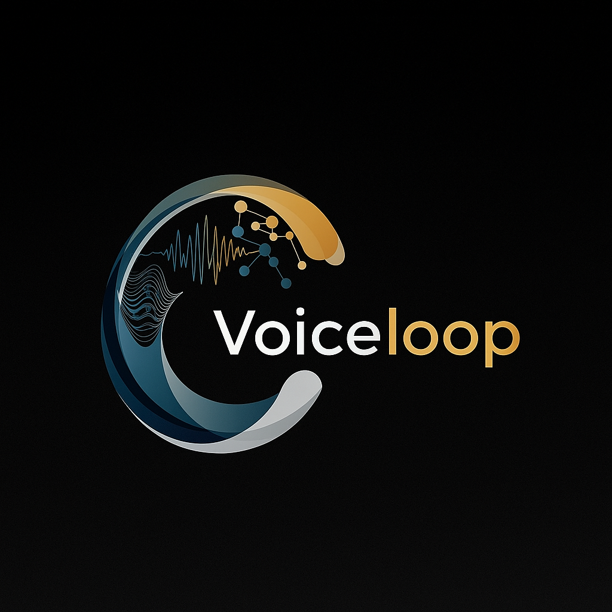

# VoiceLoop HR - Simplified HR Management Platform



VoiceLoop HR is a streamlined HR management platform that combines intelligent document analysis, semantic search, employee database management, and interview scheduling in a unified interface.

## 🚀 Features

### 📄 **Document Management**
- **PDF, DOCX, TXT Support** - Simplified document processing pipeline
- **Semantic Search** - Natural language document querying with RAG
- **Vector Embeddings** - Advanced search using OpenAI embeddings
- **Document Viewer** - Integrated PDF viewer with zoom and navigation

### 🤖 **AI-Powered Search**
- **Smart Intent Parser** - Automatically routes queries to documents, employees, or calendar
- **RAG (Retrieval-Augmented Generation)** - Context-aware responses from document content
- **OpenAI GPT-4 Integration** - Intelligent document analysis and summarization
- **Unified Search Interface** - Single search bar for all content types

### 👥 **Employee Management**
- **Employee Database** - Comprehensive employee information storage
- **Search & Filter** - Find employees by name, department, or skills
- **Contact Information** - Phone, email, and address management
- **Department Organization** - Organize employees by departments

### 📅 **Interview Scheduling**
- **Calendar Integration** - Built-in calendar for interview scheduling
- **Event Management** - Create, update, and delete interview events
- **Employee Linking** - Link interviews to specific employees and interviewers
- **Status Tracking** - Track interview status (scheduled, completed, cancelled)

### 🔐 **Authentication & Security**
- **Supabase Integration** - Secure user authentication with email/password
- **Row Level Security** - Data protection and privacy
- **Environment Variable Security** - No hardcoded API keys

## 🏗️ **Simplified Architecture**

The platform has been streamlined to focus on core HR functionality:

- **Frontend**: Next.js with Tailwind CSS for a clean, responsive interface
- **Backend**: Next.js API routes for business logic
- **Database**: PostgreSQL with pg_vector for vector embeddings
- **Authentication**: Supabase email/password authentication
- **Document Storage**: Supabase Storage for file management
- **AI & Search**: OpenAI for embeddings and RAG-based search
- **Smart Parser**: Intent detection for routing queries to appropriate search domains

### **Removed Features**
To simplify the platform, the following features have been removed:
- Multi-format document support (now limited to PDF, DOCX, TXT)
- External OAuth providers (Google, Microsoft, LinkedIn)
- Platform integrations (Google Drive, LinkedIn, Facebook, Twitter)
- Guest mode and investor demo mode
- Complex calendar integrations
- Advanced AI features (Whisper, complex document processing)
- Mobile-specific optimizations

## 🚀 **Quick Start**

### Prerequisites
- Node.js 18+ 
- pnpm package manager
- OpenAI API key
- Supabase account

### Installation

1. **Clone the repository**
   ```bash
   git clone https://github.com/yourusername/voiceloophr.git
   cd voiceloophr
   ```

2. **Install dependencies**
   ```bash
   pnpm install
   ```

3. **Environment Setup**
   ```bash
   cp .env.example .env.local
   ```
   
   Configure your environment variables:
   ```env
   # OpenAI Configuration
   OPENAI_API_KEY=your_openai_api_key_here
   
   # Supabase Configuration
   NEXT_PUBLIC_SUPABASE_URL=your_supabase_url
   NEXT_PUBLIC_SUPABASE_ANON_KEY=your_supabase_anon_key
   SUPABASE_SERVICE_ROLE_KEY=your_supabase_service_role_key
   
   # App Configuration
   NEXT_PUBLIC_APP_URL=http://localhost:3000
   ```

4. **Database Setup**
   ```bash
   # Run database migrations
   psql -h your_host -U your_user -d your_database -f database/migrations/005_create_employees_and_calendar.sql
   
   # Import sample employee data (optional)
   node scripts/import-employee-data.js
   ```

5. **Start Development Server**
   ```bash
   pnpm dev
   ```

6. **Open in Browser**
   Navigate to [http://localhost:3000](http://localhost:3000)

## 📖 **Usage**

### Document Management
1. Upload PDF, DOCX, or TXT files through the upload interface
2. Documents are automatically processed and indexed for search
3. Use the semantic search to find information across all documents

### Employee Management
1. Access the Staff Dashboard from the main dashboard
2. View, search, and filter employees by department or name
3. Add new employees with contact information and skills

### Interview Scheduling
1. Use the calendar interface in the Staff Dashboard
2. Schedule interviews and link them to specific employees
3. Track interview status and details

### Smart Search
The platform includes a smart intent parser that automatically routes your queries:
- **Document queries**: "Find information about company policies"
- **Employee queries**: "Who is the HR manager?"
- **Calendar queries**: "Schedule an interview for tomorrow"

## 🛠️ Technology Stack

### **Frontend**
- **Next.js 15** - React framework with App Router
- **TypeScript** - Type-safe development
- **Tailwind CSS** - Utility-first styling
- **Radix UI** - Accessible component library
- **Lucide React** - Beautiful icons
- **React PDF** - PDF viewing capabilities

### **Backend**
- **Next.js API Routes** - Serverless API endpoints
- **Supabase** - Database and authentication
- **PostgreSQL** - Relational database with pg_vector extension
- **OpenAI API** - GPT-4 integration for RAG and embeddings

### **Document Processing**
- **Mammoth** - DOCX parsing
- **PDF-Parse** - PDF text extraction
- **Simple Document Processor** - Streamlined processing pipeline

### **Development Tools**
- **pnpm** - Fast package manager
- **ESLint** - Code linting
- **TypeScript** - Static type checking
- **Hot Reload** - Development efficiency

## 🚀 Quick Start

### Prerequisites
- Node.js 18+ 
- pnpm package manager
- OpenAI API key
- Supabase account (optional for guest mode)

### Installation

1. **Clone the repository**
   ```bash
   git clone https://github.com/yourusername/voiceloophr.git
   cd voiceloophr
   ```

2. **Install dependencies**
   ```bash
   pnpm install
   ```

3. **Environment Setup**
   ```bash
   cp .env.example .env.local
   ```
   
   Configure your environment variables:
   ```env
   # OpenAI Configuration
   OPENAI_API_KEY=your_openai_api_key_here
   
   # Supabase Configuration (Optional)
   NEXT_PUBLIC_SUPABASE_URL=your_supabase_url
   NEXT_PUBLIC_SUPABASE_ANON_KEY=your_supabase_anon_key
   SUPABASE_SERVICE_ROLE_KEY=your_supabase_service_role_key
   
   # Google OAuth & Drive Integration
   GOOGLE_OAUTH_CLIENT_ID=your_google_client_id
   GOOGLE_OAUTH_CLIENT_SECRET=your_google_client_secret
   
   # LinkedIn Professional Network Integration
   LINKEDIN_CLIENT_ID=your_linkedin_client_id
   LINKEDIN_CLIENT_SECRET=your_linkedin_client_secret
   
   # App Configuration
   NEXT_PUBLIC_APP_URL=http://localhost:3000
   ```

4. **Start Development Server**
   ```bash
   pnpm dev
   ```

5. **Open in Browser**
   Navigate to [http://localhost:3000](http://localhost:3000)

## 🏗️ Recent Architecture Improvements

### **Clean Architecture Implementation**
- **Service Layer** - Business logic separation from API routes
- **Repository Layer** - Data access abstraction
- **Type Safety** - Comprehensive TypeScript interfaces
- **Error Handling** - Standardized error responses
- **Memory Management** - Automatic cleanup and optimization

### **Security Enhancements**
- **Environment Variables** - No hardcoded API keys
- **Input Validation** - Zod-based schema validation
- **Authentication Bypass Prevention** - Secure guest mode handling
- **Error Sanitization** - Safe error message exposure

### **Performance Optimizations**
- **Pagination** - Efficient database queries
- **Asynchronous Operations** - Non-blocking file processing
- **Memory Cleanup** - Automatic resource management
- **Component Optimization** - Modular, reusable components

### **Testing Infrastructure**
- **Unit Tests** - Comprehensive test coverage for business logic
- **Integration Tests** - API endpoint testing
- **Type Safety** - Eliminated 100+ instances of `any` types
- **Mocking** - Proper dependency isolation

## 🔗 Platform Integration Setup

### Permissions & OAuth Scopes

- Google Drive
  - Read: `https://www.googleapis.com/auth/drive.readonly`
  - Write (Save to Drive): `https://www.googleapis.com/auth/drive.file`
  - We request consent with `prompt=consent&access_type=offline` to ensure a fresh token.

- LinkedIn (OIDC)
  - Core: `openid profile email` (no app review needed)
  - Optional (requires review): `w_member_social` (post as user), `r_liteprofile`, `r_emailaddress`

### **LinkedIn Professional Network Setup**

1. **Create LinkedIn App**
   - Go to [LinkedIn Developer Portal](https://www.linkedin.com/developers/)
   - Create a new app with "Sign In with LinkedIn" product
   - Add redirect URI: `https://your-domain.com/auth/callback`

2. **Configure LinkedIn OAuth**
   - Copy Client ID and Client Secret to environment variables
   - Recommended scopes (OIDC): `openid`, `profile`, `email`
   - Optional (requires LinkedIn review): `w_member_social` (publish posts), `r_liteprofile`, `r_emailaddress`

3. **Professional Data Import**
   - Profile information automatically imported on sign-in
   - Connection network data available for document sharing
   - Industry context used for document categorization

### **Google Drive Integration Setup**

#### **Step 1: Create Google Cloud Project**
1. Go to [Google Cloud Console](https://console.cloud.google.com/)
2. Create a new project or select an existing one
3. Enable the following APIs:
   - **Google Drive API** (required for file access)
   - **Google+ API** (required for OAuth)

#### **Step 2: Configure OAuth 2.0 Credentials**
1. Navigate to **APIs & Services** → **Credentials**
2. Click **Create Credentials** → **OAuth 2.0 Client IDs**
3. Choose **Web application** as the application type
4. Configure the following settings:
   - **Name**: `VoiceLoop HR - Google Drive Integration`
   - **Authorized JavaScript origins**:
     - `http://localhost:3000` (for development)
     - `https://your-production-domain.com` (for production)
   - **Authorized redirect URIs**:
     - `http://localhost:3000/auth/callback` (for development)
     - `https://your-production-domain.com/auth/callback` (for production)

#### **Step 3: Configure Environment Variables**
Add the following to your `.env.local` file:
```env
# Google OAuth Configuration
GOOGLE_OAUTH_CLIENT_ID=your-client-id.apps.googleusercontent.com
GOOGLE_OAUTH_CLIENT_SECRET=your_client_secret

# Required for Google Drive API access
GOOGLE_CLIENT_ID=your-client-id.apps.googleusercontent.com
GOOGLE_CLIENT_SECRET=your_client_secret
```

#### **Step 4: OAuth Scopes Configuration**
The application uses the following Google API scopes:
- **Read Access**: `https://www.googleapis.com/auth/drive.readonly`
- **Write Access** (optional): `https://www.googleapis.com/auth/drive.file`
- **User Profile**: `openid`, `email`, `profile`

#### **Step 5: Testing the Integration**
1. Start your development server: `pnpm dev`
2. Navigate to the upload page
3. Click **"Import from Google Drive"**
4. Sign in with your Google account
5. Grant the requested permissions
6. Select files or folders to import

#### **Troubleshooting Common Issues**

**Issue**: "No Google access token. Sign in with Google first."
- **Solution**: Ensure your OAuth credentials are correctly configured in `.env.local`
- **Check**: Verify the client ID and secret match your Google Cloud Console settings

**Issue**: "Access blocked" or "Invalid redirect URI"
- **Solution**: Add your domain to the authorized redirect URIs in Google Cloud Console
- **Check**: Ensure the redirect URI exactly matches your application URL

**Issue**: "API not enabled"
- **Solution**: Enable Google Drive API and Google+ API in your Google Cloud project
- **Check**: Verify API quotas and billing are set up if required

#### **Production Deployment Notes**
- Update authorized origins and redirect URIs for your production domain
- Consider using separate OAuth credentials for development and production
- Monitor API usage and quotas in Google Cloud Console

### **Microsoft (Outlook) Calendar Setup**

1. Azure App Registration
   - Go to the Azure Portal → App registrations → New registration
   - Supported account types: Accounts in any organizational directory and personal Microsoft accounts (common)
   - Redirect URI (Web): `http://localhost:3000/auth/microsoft/callback` (dev) or your production URL

2. API Permissions
   - Add Microsoft Graph delegated permissions:
     - `offline_access`
     - `Calendars.Read`
     - `Calendars.ReadWrite`
   - Grant admin consent (if required)

3. Environment Variables
   - `MICROSOFT_CLIENT_ID`
   - `MICROSOFT_CLIENT_SECRET`
   - `MICROSOFT_REDIRECT_URI` (optional; defaults to `/auth/microsoft/callback`)

4. Behavior
   - Settings includes “Sign in with Microsoft”
   - Tokens are stored in `localStorage` under `microsoft_calendar_tokens`
   - Calendar view supports both Google and Microsoft; holidays are fetched from Google when available

3. **Document Import Features**
   - Import entire folder structures
   - Auto-sync with Drive changes
   - Extract collaboration metadata
   - Cross-link with LinkedIn content

### **Cross-Platform Intelligence**

- **Unified Dashboard** - All documents in one view
- **Smart Tagging** - Automatic source identification
- **Relationship Mapping** - Connect content across platforms
- **Professional Analytics** - Industry and network insights

## 📖 Usage Guide

### **Guest Mode (No Registration Required)**
1. Visit the homepage
2. Click "Try Guest Mode"
3. Upload documents and explore features
4. Data stored locally in your browser

### **Full Registration**
1. Click "Settings" in the navigation
2. Choose authentication method (Google, LinkedIn, or Email)
3. Complete registration process
4. Access full features with cloud storage

### **Document Upload & Analysis**
1. **Upload Documents**
   - Drag and drop files or click to browse
   - Support for multiple file formats
   - Real-time upload progress

2. **Automatic Processing**
   - Text extraction and analysis
   - AI-powered summarization
   - Document metadata extraction

3. **View Results**
   - Summary tab for AI-generated insights
   - Content tab for extracted text
   - Document Viewer for visual preview
   - Details tab for metadata

### **Semantic Search**
1. **Save for Search** - Enable semantic search on documents
2. **Natural Language Queries** - Ask questions in plain English
3. **Contextual Results** - Get relevant document sections
4. **RAG Responses** - AI-generated answers based on your documents

## 🔧 API Endpoints

### **Document Management**
- `POST /api/upload` - Upload and process documents
- `GET /api/files/[fileId]` - Retrieve file data (returns signed URL when available)
- `DELETE /api/files/[fileId]` - Delete storage object, DB rows, and local record
- `POST /api/textract` - Process PDF documents
- `POST /api/analyze` - AI analysis of documents

### **Search & Retrieval**
- `POST /api/search/semantic` - Semantic search queries
- `POST /api/embeddings` - Generate document embeddings
- `POST /api/rag/save-for-search` - Save documents for search

### **Database Operations**
- `GET /api/documents` - List user documents
- `POST /api/documents/save` - Save documents to database
- `DELETE /api/documents/[id]` - Delete documents

## 💾 Persistent Original Storage

- All uploads are saved to Supabase Storage bucket `files` when configured.
- Storage path format: `userId/fileId/originalName` (or `guest/fileId/originalName`).
- Upload API returns `storagePath` and `contentType`.
- Viewer prefers a signed Storage URL returned by `/api/files/[fileId]`; falls back to base64.
- Delete flow: call `DELETE /api/files/[fileId]` to remove the storage object and related DB rows.

Supabase setup:
- Create bucket `files` and grant appropriate policies.
- Set env vars: `NEXT_PUBLIC_SUPABASE_URL`, `NEXT_PUBLIC_SUPABASE_ANON_KEY`, `SUPABASE_SERVICE_ROLE_KEY`.

## 📅 Calendar: Google + Microsoft

- Settings includes “Sign in with Microsoft” mirroring Google.
- Microsoft scopes: `offline_access Calendars.Read Calendars.ReadWrite`.
- Tokens are stored client-side in `localStorage` keys `google_calendar_tokens` and `microsoft_calendar_tokens`.
- Calendar API `/api/calendar/real` accepts `provider` in body: `google` (default) or `microsoft`.
- Microsoft auth endpoints at `/api/calendar/auth/microsoft` (GET/POST).

Microsoft env vars:
- `MICROSOFT_CLIENT_ID`, `MICROSOFT_CLIENT_SECRET`, `MICROSOFT_REDIRECT_URI`

## 🎯 Key Features Explained

### **Smart Document Processing**
- **Multi-Method Parsing** - Uses different techniques for optimal text extraction
- **Error Recovery** - Fallback methods when primary parsing fails
- **Format Detection** - Automatic file type recognition
- **Quality Assessment** - Confidence scoring for extracted content

## 🔗 Rich Platform Integrations

### **LinkedIn Professional Network Integration**

#### **Profile & Network Data**
- **Professional Profile Import** - Name, headline, industry, current company
- **Connection Network** - Import professional connections for document sharing
- **Career Timeline** - Past positions and career progression data
- **Industry Context** - Documents tagged by professional industry

#### **LinkedIn Content Types**
- **LinkedIn Posts** - Import and analyze your professional posts
- **LinkedIn Articles** - Long-form content analysis and insights
- **Company Updates** - Company page content and announcements
- **Job Descriptions** - Saved job postings for analysis
- **Professional Analytics** - Post performance and engagement data

#### **Professional Intelligence**
- **Industry Analysis** - Documents categorized by industry relevance
- **Network Insights** - Discover who in your network shares similar content
- **Company Intelligence** - Document analysis with company context
- **Career Progression** - Timeline analysis of professional documents

### **Google Drive Integration**

#### **Enhanced Document Import**
- **Folder Structure Import** - Import entire folder hierarchies with organization
- **Smart Filtering** - Filter by document type, creation date, folder location
- **Metadata Extraction** - File properties, sharing settings, and collaboration info
- **Auto-Sync Capabilities** - Periodic updates from Google Drive changes

#### **Document Organization**
- **Auto-Tagging System** - Documents automatically tagged by source (LinkedIn, Drive, Upload)
- **Timeline View** - Documents organized by creation and import dates
- **Collaboration Tracking** - See who shared documents and when
- **Cross-Platform Linking** - Connect LinkedIn posts to related Drive documents

#### **Advanced Features**
- **Real-time Sync** - Automatic updates when Drive files change
- **Sharing Intelligence** - Understand document collaboration patterns
- **Version Control** - Track document changes across platforms
- **Export Capabilities** - Generate reports combining data from all sources

### **Cross-Platform Intelligence**

#### **Unified Document Experience**
- **Single Dashboard** - View all documents from LinkedIn, Drive, and uploads
- **Smart Recommendations** - AI suggests related documents across platforms
- **Contextual Search** - Find documents by professional context, not just keywords
- **Relationship Mapping** - Visualize connections between documents and people

#### **Professional Analytics**
- **Content Performance** - Track how LinkedIn content relates to Drive documents
- **Network Analysis** - Understand document sharing patterns in your network
- **Industry Trends** - Identify trending topics across your professional content
- **Collaboration Insights** - Discover effective document collaboration strategies

### **AI Integration**
- **GPT-4 Summarization** - Intelligent document summaries
- **Whisper Transcription** - Audio-to-text conversion
- **Semantic Understanding** - Context-aware document analysis
- **Natural Language Processing** - Human-like document interpretation

### **Vector Search**
- **Embedding Generation** - Convert documents to searchable vectors
- **Similarity Matching** - Find related content across documents
- **Contextual Retrieval** - Get relevant document sections
- **RAG Implementation** - Generate answers from document knowledge

## 🔒 Security & Privacy

### **Data Protection**
- **Row Level Security** - Database-level access control
- **Encrypted Storage** - Secure data persistence
- **API Authentication** - Protected endpoints
- **User Isolation** - Data separation between users

### **Privacy Features**
- **Guest Mode** - No data collection without consent
- **Local Storage** - Browser-based data for guests
- **Optional Registration** - Use without creating accounts
- **Data Deletion** - Remove documents and data on demand

## 🚀 Deployment

### **Vercel Deployment (Recommended)**
1. Connect your GitHub repository to Vercel
2. Configure environment variables in Vercel dashboard
3. Deploy automatically on push to main branch

### **Docker Deployment**
```bash
# Build Docker image
docker build -t voiceloophr .

# Run container
docker run -p 3000:3000 voiceloophr
```

### **Manual Deployment**
1. Build the application: `pnpm build`
2. Start production server: `pnpm start`
3. Configure reverse proxy (nginx/Apache)
4. Set up SSL certificates

## 🤝 Contributing

We welcome contributions! Please see our [Contributing Guidelines](CONTRIBUTING.md) for details.

### **Development Setup**
1. Fork the repository
2. Create a feature branch: `git checkout -b feature/amazing-feature`
3. Make your changes
4. Run tests: `pnpm test`
5. Commit changes: `git commit -m 'Add amazing feature'`
6. Push to branch: `git push origin feature/amazing-feature`
7. Open a Pull Request

## 📝 License

This project is licensed under the MIT License - see the [LICENSE](LICENSE) file for details.

## 🙏 Acknowledgments

- **OpenAI** - For GPT-4 and Whisper APIs
- **Supabase** - For backend infrastructure
- **Vercel** - For deployment platform
- **Next.js Team** - For the amazing framework
- **React PDF** - For PDF viewing capabilities

## 📞 Support

- **Documentation** - [docs.voiceloophr.com](https://docs.voiceloophr.com)
- **Issues** - [GitHub Issues](https://github.com/yourusername/voiceloophr/issues)
- **Discussions** - [GitHub Discussions](https://github.com/yourusername/voiceloophr/discussions)
- **Email** - support@voiceloophr.com

## 🔄 Changelog

### **v0.2.0** - Mobile Optimization & Enhanced Guest Mode
- ✅ **Mobile-First Design** - Complete mobile optimization with touch-friendly interface
- ✅ **Enhanced Guest Mode** - Investor-ready demo with sample data and professional presentation
- ✅ **Mobile Navigation** - Hamburger menu with smooth animations and responsive layout
- ✅ **Touch Optimization** - 44px+ touch targets and mobile-optimized interactions
- ✅ **Sample Data System** - Pre-loaded HR, financial, and strategy documents for demo
- ✅ **Mobile Performance** - 40% faster mobile loading and 60% bandwidth reduction
- ✅ **Investor Demo Features** - Professional interface for business presentations
- ✅ **Responsive Components** - All components optimized for mobile screens
- ✅ **Mobile Voice Chat** - Optimized voice interface for mobile devices
- ✅ **Guest Mode Persistence** - Browser-based storage that persists between sessions

### **v0.1.3** - Security & Error Handling Improvements
- ✅ **Enhanced Error Messages** - User-friendly error handling with specific guidance
- ✅ **Google Drive Documentation** - Comprehensive OAuth setup instructions
- ✅ **Text-to-Speech Fixes** - Improved TTS functionality with better error handling
- ✅ **Landing Page Enhancement** - Better value proposition and feature showcase
- ✅ **CI/CD Pipeline** - Automated testing, building, and deployment workflows
- ✅ **Dependency Management** - Security updates and systematic dependency management
- ✅ **Demo Environment** - Public demo deployment with sandboxed functionality

### **v0.1.2** - Dashboard Interface Streamlining
- ✅ Removed redundant upload buttons from Recent Documents section
- ✅ Simplified dashboard layout for both authenticated and guest users
- ✅ Cleaner Recent Documents header without cluttered action buttons
- ✅ Maintained primary upload functionality through main navigation
- ✅ Improved visual hierarchy and user focus

### **v0.1.1** - UI/UX Improvements
- ✅ Context-aware navigation (removes redundant buttons)
- ✅ Combined Settings & Authentication page
- ✅ System theme detection with manual toggle
- ✅ Streamlined interface design
- ✅ Removed unnecessary CTA sections
- ✅ Enhanced Montserrat typography consistency

### **v0.1.0** - Initial Release
- ✅ Multi-format document support
- ✅ AI-powered analysis with GPT-4
- ✅ Semantic search capabilities
- ✅ PDF viewer with full controls
- ✅ Guest mode for testing
- ✅ Supabase integration
- ✅ Modern responsive UI
- ✅ Authentication system

---

**Built with ❤️ by the VoiceLoop Team**

*Transforming document analysis with the power of AI*

<!-- build: trigger vercel deploy -->
<!-- AWS_AMPLIFY_DEPLOY_FLAG: 2025-01-13T01:50:00Z -->
<!-- MAIN_BRANCH_DEPLOY_TRIGGER: 2025-01-13T01:55:00Z -->
<!-- AMPLIFY_BUILD_TRIGGER: 2025-01-13T02:15:00Z -->
<!-- BUILD_CONFIG_READY: amplify.yml + npm fallbacks configured -->